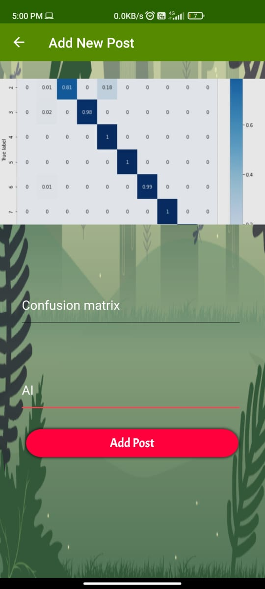
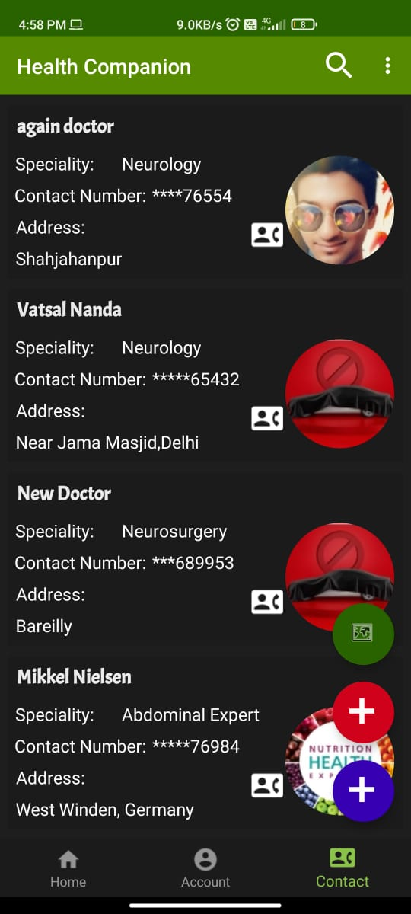
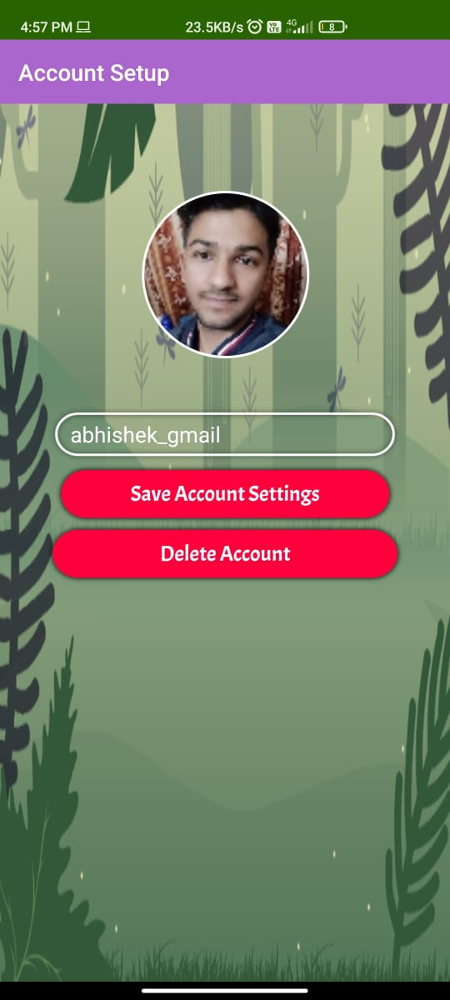
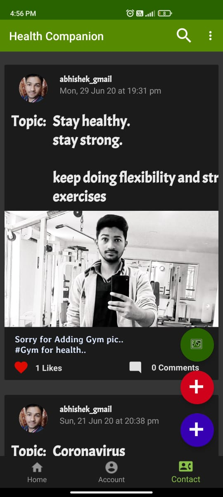

# Health-BRO
Download [Health-BRO APK](https://drive.google.com/file/d/1Nzo3oHOFuK5NhOcOZd3NahxXe3CbSp5r/view?usp=sharing)

# Important Notice
The "google-services.json" file is modified and project info is removed for security purpose. To use this project you may need to import "google-services.json" file from your own Firebase Project. 

# Features
- Signin with google, email and anonymous account using firebase AuthUI.
- Authorized users can articles but cannot add doctor in doctor's list.
- Only admins can add doctors.
- Anonymous users can only views articles and doctor list.
- Users have to upload profile picture and name before posting an article.
- Users can select topic from search icon to fetch related articles.

### Make sure to run all these three simultaneously so that app functions properly 

## Mobile Application Screenshots

|                 Adding new post                 |                 pic editing                       |                    Doctors list                 |
|:-------------------------------------------------:|:-------------------------------------------------:|:-------------------------------------------------:|
|  |  |  |

|                 Account Setup                 |                 Sign IN                      |                    Homepage                 |
|:-------------------------------------------------:|:-------------------------------------------------:|:-------------------------------------------------:|
|  |  |  |

 

### Built by Developers </>
### Built with Love ❤️
